# *Feed-Forward-Style-Transfer* implemented in TensorFlow

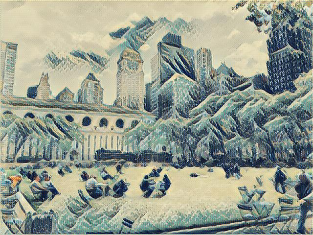

This is a TensorFlow implementation of *[Perceptual Losses for Real-Time Style Transfer
and Super-Resolution](http://cs.stanford.edu/people/jcjohns/papers/eccv16/JohnsonECCV16.pdf)* using [instance normalization]() as a regularizer to improve training efficiency and test results.<sup>[1](#footnote1)</sup>

The loss derived from *[A Neural Algorithm of Artistic Style](https://arxiv.org/pdf/1508.06576v2.pdf)* is used to train a generative neural network to apply artistic style transfer to some input image. [Total variation denoising](http://eeweb.poly.edu/iselesni/lecture_notes/TVDmm/TVDmm.pdf) is used as a regularizer to reduce unrealistic constrast between adjacent pixels, which in turn reduces visible noise. 

Unlike the non-feed-forward implementation, our implementation is deterministic due to the nature of the generator.

#### Implementation Architecture

We used a generative convolutional neural network with downsampling layers followed by [residual blocks](https://arxiv.org/abs/1512.03385) then upsampling by [deconvolutional](https://en.wikipedia.org/wiki/Deconvolution) layers. Normalization of inputs is performed to reducing internal covariate shift.

For description of the generator's output, we used a pretrained [VGG network](https://arxiv.org/pdf/1409.1556.pdf), which is provided [here](https://github.com/machrisaa/tensorflow-vgg) by [machrisaa](https://github.com/machrisaa) on GitHub. The VGG implementation was customized to accomodate our requirements and is of the 16-layer variety.

<sup name="footnote1">1</sup> Our [generative network](../src/generator.py) can still support [batch normalization](https://arxiv.org/pdf/1502.03167v3.pdf) if needed. Simply replace instance normalization calls with batch normalization and adjust the generator's input size.

## Results

<table style="width:100%">

  <tr>
    <td></td>
    <td>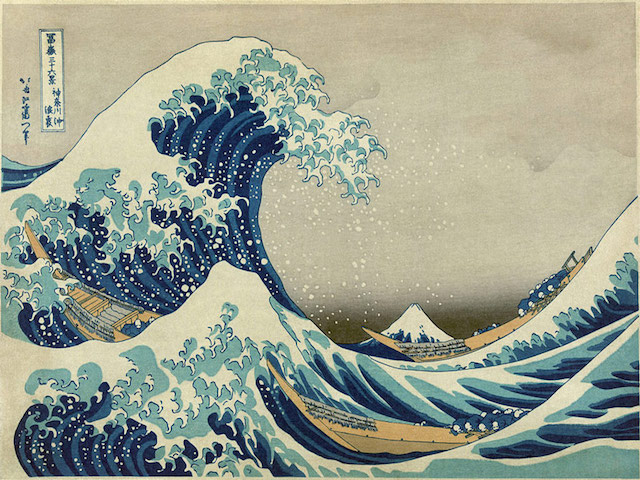</td> 
    <td>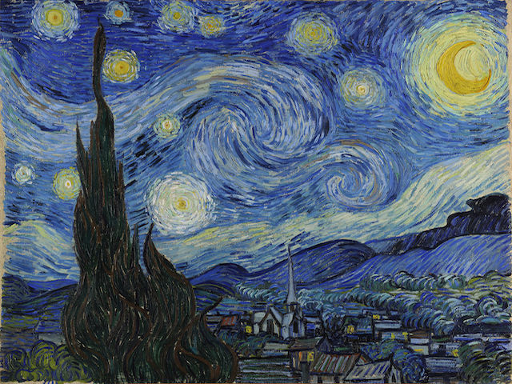</td> 
    <td>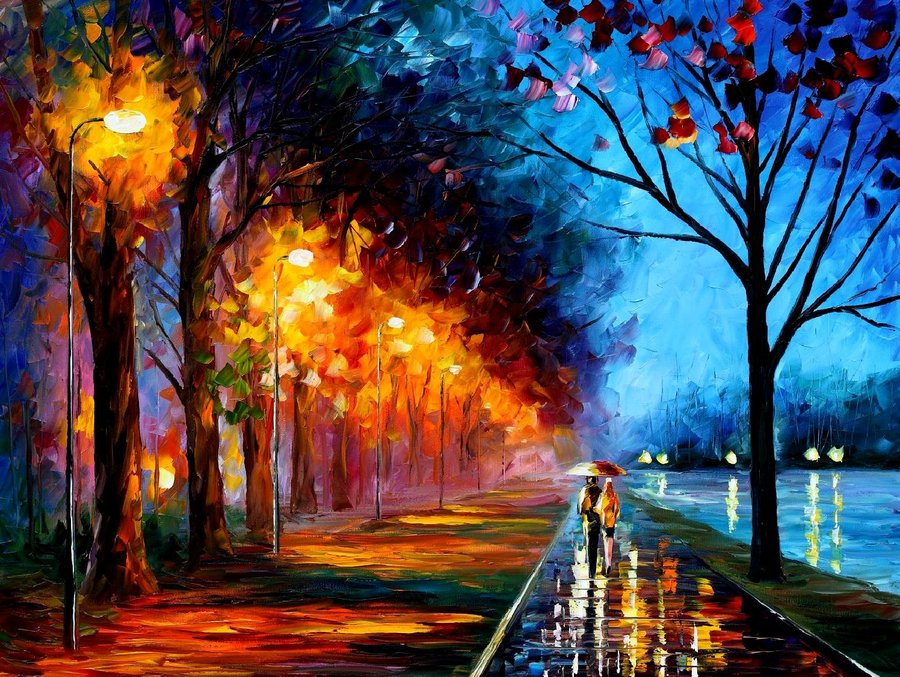</td> 
  </tr>
  
  <tr>
    <td>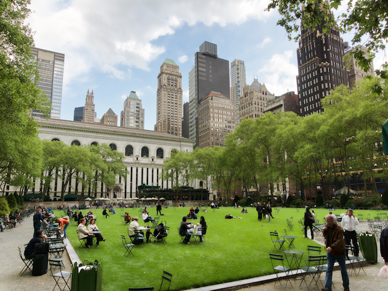</td>
    <td></td> 
    <td>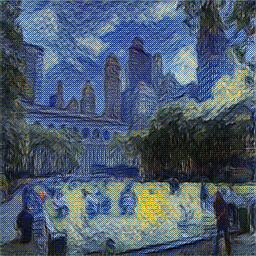</td> 
    <td>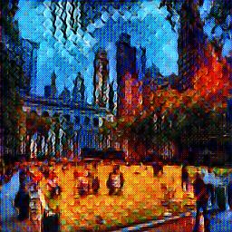</td> 
  </tr>
  
  <tr>
    <td></td>
    <td>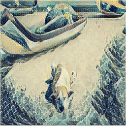</td> 
    <td>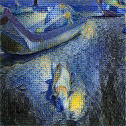</td> 
    <td>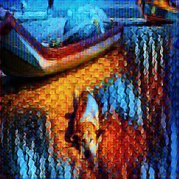</td> 
  </tr>
  
  <tr>
    <td>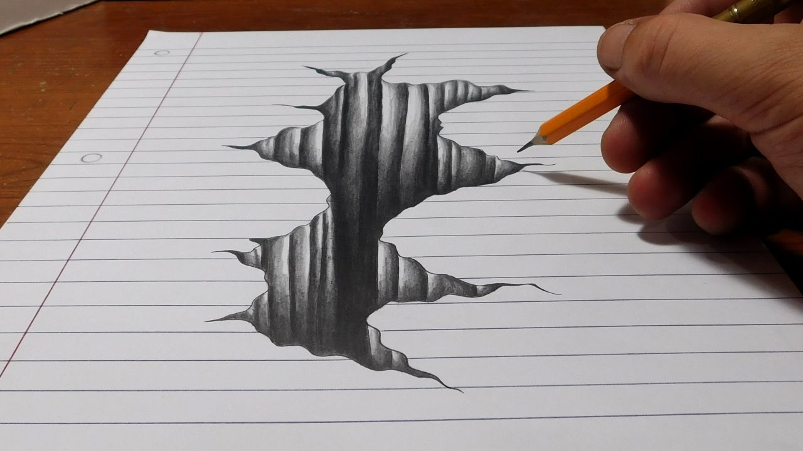</td>
    <td>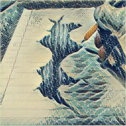</td> 
    <td>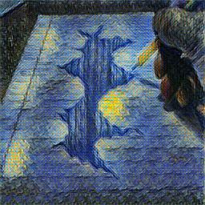</td> 
    <td>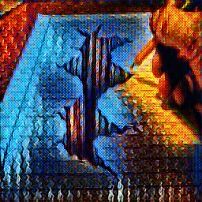</td> 
  </tr>
  
</table>

## Prerequisites

* [Python 3.5](https://www.python.org/downloads/release/python-350/)
* [TensorFlow](https://www.tensorflow.org/) (>= r0.12)
* [scikit-image](http://scikit-image.org/docs/dev/api/skimage.html)
* [NumPy](http://www.numpy.org/)

## Usage

To train a generative model to apply artistic style transfer invoke *train.py* with the file path of the image who's style you'd like to learn. 
A new directory with the name of the file will be created under the [lib/generators](./lib/generators) and it will contain the network's trained paramater values for future use. 

```
python train.py /path/to/style/image
```

To apply artistic style transfer to an image, invoke *test.py* with its file path through --input and specify the desired style through --style (i.e., "starry-night").

```
python test.py --input /path/to/input/image --style "style name"
```

To list available styles (trained models in [lib/generators](./lib/generators), invoke *test.py* with the --styles flag.

```
python test.py --styles
```


## Files

* [test.py](./src/test.py)

    Stylizes an image using a generative model trained on a particular style.

* [train.py](./src/train.py)

    Trains a generative model for stylizing an unseen image input with a particular style.
    
* [trainer.py](./src/trainer.py)

    Trainer class for training a new generative model. This script is called from *train.py* after a style image path is specified.

* [generator.py](./src/generator.py)

    Generative model with the architectural specifications suited for artistic style transfer.

* [helpers.py](./src/helpers.py)

    Helper class containing various methods with their functions ranging from image retrieval to auxiliary math helpers.

* [custom_vgg16.py](./src/custom_vgg16.py)

    Descriminative model trained on image classification used for gathering statistics to describe our loss measure.

    The weights used by the VGG network. This file is not in this repository due to its size. You must download it and place in the working directory. The program will complain and ask for you to download it with a supplied link if it does not find it.